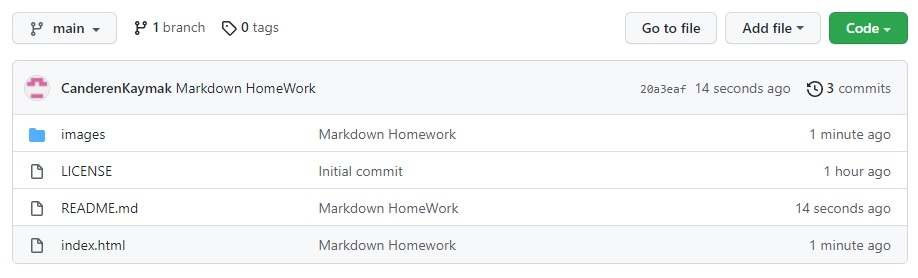

# Kodluyoruz Test Repo

Kodluyoruz eğitimleri kapsamında test amaçlı oluşturduğum repository. İçerisinde README dosyası ve bir adet index.html dosyası barındırıyor



## Installation

Öncelikle projeyi klonlayın. (https://github.com/CanderenKaymak/KodluyoruzTestRepo.git)


``` 
git clone https://github.com/CanderenKaymak/KodluyoruzTestRepo.git 

``` 

## Usage

Projeyi clonladıktan sonra Visual Studio Code programında açınız.

Linux için:

```
cd kodluyoruztestrepo
code .

```

## Contributingi

Pull requestler kabul edilir. Büyük değişikler içini lütfen önce neyi değiştirmek istediğinizi tartışmak için bir konu açınız.

## License

[MIT](https://choosealicense.com/licenses/mit/)